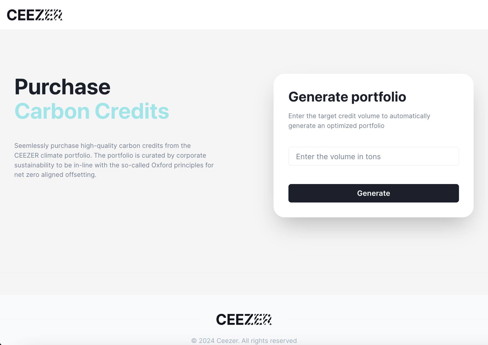
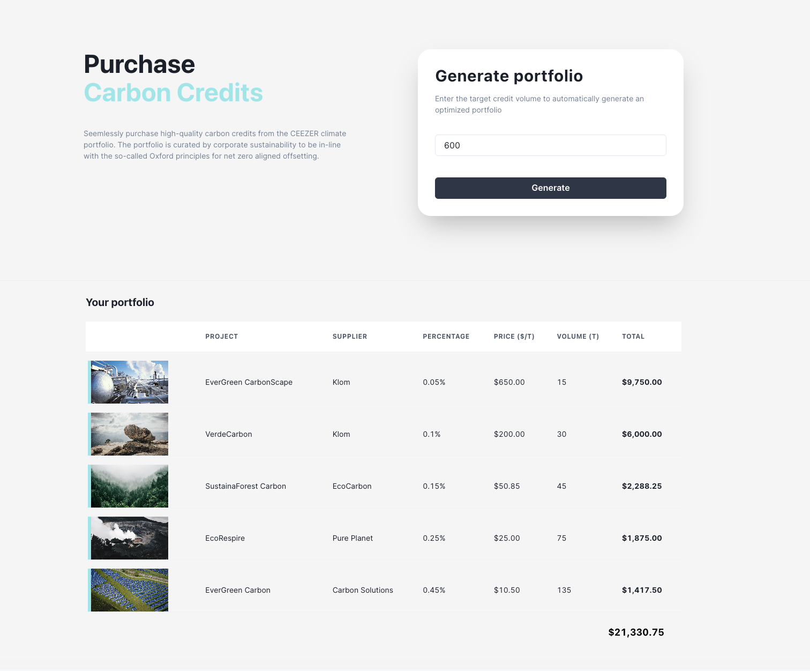
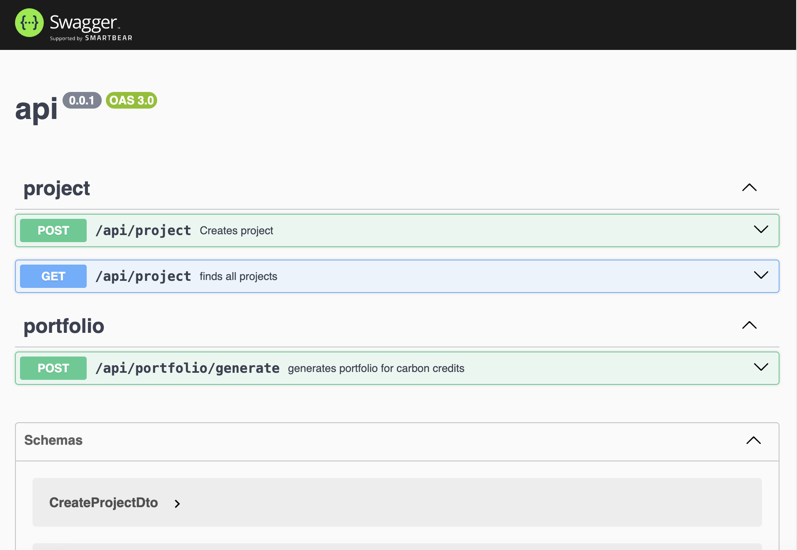

# Carbon Credits Portfolio

This is a full-stack responsive application that generates a portfolio for the requested volume(tons) with a variety of carbon credits for customers.

> It's a monorepo implemented using Typescript, Nest.js, Node.js, Next.js, React.js, and Chakra UI Library as well as React Context API for state management as it is a very trivial application, it uses mongo db for database and is configured using turbo.

<p align="center">
    <a href="https://carbon-credits-portfolio-production.up.railway.app" target="blank">UI Demo</a>
</p>

<p align="center"></p>

<p align="center"></p>

<p align="center"></p>


## Application

This monorepo includes both api (backend) and ui (frontend) projects under the apps folder.
[api - NestJS app](/app/api)
[ui - Next.js app](/apps/ui)

## Features

Users can input the desired volume in tons of carbon credits. Once submitted, the page will generate and display a recommended portfolio with the following principles:

#### Principles
1. The portfolio should aim to use the maximum amount of tons while respecting the distribution weight.
2. The number of tons in a project should be proportional to its "distribution_weight" ( dw ) relative to the total distribution weight.
3. If a single project doesn't supply sufficient credits, the portfolio should compensate for the shortfall by utilizing credits from other projects for the remaining amount, while adhering to the distribution rule mentioned above.
4. The portfolio's tonnage can be less than the user's request if there's insufficient available volume, but it must never exceed the requested amount.
Remember, the portfolio's creation should be driven by these guidelines while considering the user's input and the availability of credits.

#### Distribution Example
The customer requests 60 tons:
1. There are five projects available with the following distribution weights:
p1dw : 0.05, p2dw : 0.1, p3dw : 0.15, p4dw : 0.25, p5dw : 0.45.
2. In this case, all projects have enough volume to satisfy the distribution
weights.
3. The algorithm should allocate the following tonnage for each project:
a. p1 = 3t
b. p2 = 6t
c. p3 = 9t
d. p4 = 15t
e. p5 = 27t

> [!IMPORTANT]  
> The portfolio's tonnage should not exceed the distribution weight to the total distribution weight(consider it always sums up to 100%) of all projects while respecting the allowed volume for each project.
> 
> If the customer requests 600 tons, considering the above-mentioned distribution weights, the tonnage should be as follows
> - p1 = 15
> - p2 = 30
> - p3 = 45
> - p4 = 75
> - p5 = 135
>

## Technologies

#### Backend

- [Nest.js v10.0.0](https://nestjs.com/)
- [Nest Mongoose](https://www.npmjs.com/package/@nestjs/mongoose)
- [Swagger Documentation](https://www.npmjs.com/package/@nestjs/swagger)
- [Typescript v5](https://www.typescriptlang.org/)
- [Node.js v18.20.2](https://nodejs.org/)

#### Frontend

- [React JS v18](https://react.dev/)
- [Context API](https://react.dev/reference/react/createContext)
- [Chakra UI Library](https://v2.chakra-ui.com/)
- [react-hook-form v7.51.4](https://react-hook-form.com/)
- [yup validation](https://www.npmjs.com/package/yup)
- [Typescript v5](https://www.typescriptlang.org/)
- [Node.js v18.20.2](https://nodejs.org/)

## Installation Steps

> Check out the readme for the sub folders [ui](/apps/ui/README.md) and [api](/apps/api/README.md) respectively.

#### Prerequisites
> This project is configured using turbo for build and development. Please before running the app, make sure to install the following software in your system locally.

 - [Turbo](https://turbo.build/) install globally - Turbo is an incremental bundler and build system optimized for JavaScript and TypeScript, written in Rust.
 - [Node.js v18]((https://nodejs.org/))
 - [Mongodb](https://www.mongodb.com/try/download/community) or MongoDB connection string.

> [!CAUTION]
> Once the database is installed locally, insert the data into DB from the [CSV file](projects_sample.csv).

#### Setup

1. Clone the repository

```bash
git clone https://github.com/ravisankarchinnam/carbon-credits-portfolio.git
```

2. Create a .env file using .env.example for both the [apps/api](/apps/api) and [apps/ui](/apps/ui) add the following environment variables

- [apps/ui](/apps/ui)
    ```bash
    #### API URL ENV VARS ###
    NEXT_PUBLIC_APP_API_URL=[YOUR_API_URL] #http://localhost:4000/api

    ```

- [apps/api](/apps/api)
    ```bash
    MONGODB_URI=[YOUR_MONGODB_URI] #http://localhost:27017/ceezer
    MONGODB_URI_TEST=[YOUR_MONGODB_URI_FOR_TEST] #mongodb://localhost:27017/test_ceezer
    API_PORT=[YOUR_PORT] #4000
    ```

3. Installing dependencies
> Navigate to the root folder of the project directory and run the following command to install dependencies for both [apps/api](/apps/api) and [/apps/ui](/apps/ui).

```bash
npm ci
```

4. Running the application locally
> Run the following command in your root directory to start both the [apps/api](/apps/api) and [apps/ui](/apps/ui) in development mode.
```bash
npm run dev
```

## Building the application

1. Installing dependencies
> Navigate to the root folder of the project directory and run the following command to build both [apps/api](/apps/api) and [apps/ui](/apps/ui).

```bash
npm run build
```

2. Running the application for production
> Run the following command to start both the [apps/api](/apps/api) and [apps/ui](/apps/ui).
```bash
npm run start
```

## Deployment

> This App is deployed to the railway.app, please use this link to access the site [https://carbon-credits-portfolio-production.up.railway.app](https://carbon-credits-portfolio-production.up.railway.app)

### Tests
This project contains api tests as part of the development. Run the following commands to run the tests locally.

```bash
cd apps/api
npm run test
npm run test:e2e
```

### Improvements

#### Frontend

1. Interface to the project detail page
2. Virtualized lists rendering large data table
3. Interface to Login/Register
4. Interface to CRUD Projects
5. Implement validation for project creation for distribution weight percentage
6. Dynamic forms creation by JSON
7. Implement Custom UI Library (Storybook)
8. Implement Favorites/Wishlist for projects
9.  Add Error pages
10. Lazy loading for images
11. Configure Redux/React-query as the project grows
12. Write frontend tests
13. Configure pre-commit hooks(husky)
14. I18N for multiple languages


#### Backend

1. Configure Indexing and set Caching mechanism
2. Introduce advanced filtering for the search
3. Implement user creation to save search history
4. Implement Role based authentication for creating projects
5. Implement Cursor pagination for the search in case of huge datasets
6. Implement CRUD Operations for Projects
7.  Potential to convert to microservices as the project grows

## Version

0.1.0

## Author

Ravisankar Chinnam
