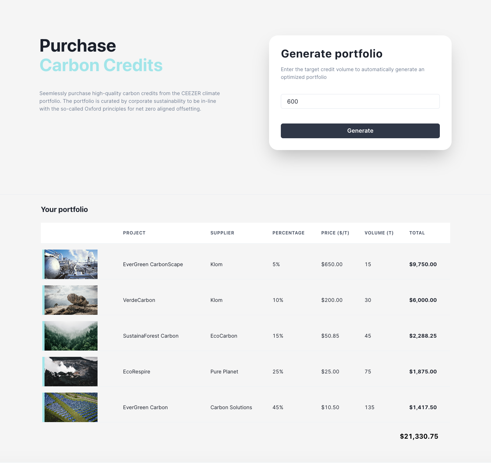

# Carbon Credits Portfolio - UI

> Interface to generate a portfolio for the requested volume(tons) with a variety of carbon credits for customers.

> It's implemented using Typescript, React.js, Next.js, Chakra UI Library and React Context API for state management as it is very trivial application and configured using turbo.

<p align="center">
    <a href="https://app/" target="blank">UI Demo</a>
</p>

<p align="center"></p>

<p align="center"></p>

## Libraries

- [React JS v18](https://react.dev/)
- [Context API](https://react.dev/reference/react/createContext)
- [Chakra UI Library](https://v2.chakra-ui.com/)
- [react-hook-form v7.51.4](https://react-hook-form.com/)
- [yup validation](https://www.npmjs.com/package/yup)
- [Typescript v5](https://www.typescriptlang.org/)
- [Node.js v18.20.2](https://nodejs.org/)

## Installation Steps

> This project configured using turbo for build and development and you don't need to run these below steps unless you want to start separately. Please before running the app, make sure to install the [Node.js v18](<(https://nodejs.org/)>) in your system locally.

1. Clone the repository

```bash
git clone https://github.com/ravisankarchinnam/carbon-credits-portfolio.git
```

2. Change the working directory

```bash
cd apps/ui
```

3. Create `.env` file and add your variables

```bash
NEXT_PUBLIC_APP_API_URL=[YOUR_API_BASE_URL] #http://localhost:4000/api
```

4. Install dependencies

```bash
npm ci
```

5. Run the app

```bash
npm run dev
```

> You are all set! Open [localhost:3000](http://localhost:3000/) to see the app.

> `npm run build` - which generates a build folder with all the files ready for the prod deployment in the same `ui` folder.

## Deployment

> This App is deployed to railway.app, please use this link to access the site [https://carbon-credits-portfolio-production.up.railway.app](https://carbon-credits-portfolio-production.up.railway.app)

## Improvements

#### Frontend

1. Interface to project page
2. Virtualized lists rendering large data table
3. Interface to Login/Register
4. Interface to CRUD Projects
5. Implement validation for project creation for distribution weight percentage
6. Dynamic forms creation by json
7. Implement Custom UI Library (Storybook)
8. Implement Favorites/Wishlist for projects
9. Add Error pages
10. Lazy loading for images
11. Configure Redux/React-query as the project grows
12. Write frontend tests
13. Configure pre commit hooks(husky)
14. I18N for multiple languages
15. Lot more possibilities...

## Author

> Ravisankar Chinnam
